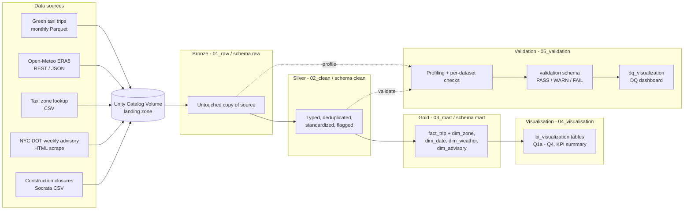

# NYC Mobility Data Pipeline

> From public data sources to a trusted NYC mobility dataset. Week 8 challenge: ingest, clean, model, and validate NYC mobility data in a repeatable Databricks pipeline.

**Platform:** Databricks (Unity Catalog) · **Catalog:** `nyc_mobility` · **Pattern:** Bronze → Silver → Gold (Medallion) + Validation layer

## Contents

1. [Purpose and Overview](#1-purpose-and-overview)
2. [Architecture and Data Flow](#2-architecture-and-data-flow)
3. [Data Model](#3-data-model)
4. [How to Run](#4-how-to-run)
5. [Validation and Data Quality](#5-validation-and-data-quality)
6. [Engineering Decisions](#6-engineering-decisions)
7. [Collaboration](#7-collaboration)
8. [Handoff Requirements](#8-handoff-requirements)

---

## 1. Purpose and Overview

This project turns four public NYC datasets into a single trusted, analysis-ready dataset for studying urban mobility. It ingests green taxi trips, hourly weather, taxi zone reference data, and traffic advisories/construction closures; cleans and standardizes each; models them into a dimensional schema; and publishes query outputs that answer specific mobility questions.

The pipeline is built to be **repeatable**: every layer can be rebuilt from the one below it, raw data is preserved untouched, the traffic advisory load is idempotent, and every data-quality claim is backed by a recorded validation result.

**Business questions the model answers**

| ID  | Question                                                                                       |
| --- | ---------------------------------------------------------------------------------------------- |
| Q1a | Which borough-to-borough flows carry the highest trip volume, distance, and revenue?           |
| Q1b | Which pickup zones drive the most trip volume and revenue?                                     |
| Q2  | How do passengers, fares, and durations vary by hour of day and weekday vs. weekend?           |
| Q3  | How do weather conditions (rain, snow, clear) affect trip demand, distance, and duration?      |
| Q4  | Do traffic advisories correlate with changes in pickup volume or trip duration within boroughs? |
| —   | Consolidated KPI summary (trips, passengers, revenue, average fare/distance/duration, revenue per mile) |

**Key properties**

- **Medallion layers** with a separate validation gate.
- **Raw is untouched** — Bronze is an exact copy of what each source returned.
- **Documented, numbered decisions** for every data-quality finding (see [Engineering Decisions](#6-engineering-decisions)).
- **Shared DQ result shape** across all datasets, so results are comparable.

---

## 2. Architecture and Data Flow

### Pipeline diagram




### Layers

| Layer         | Folder             | Schema (`nyc_mobility.*`) | Purpose                                                                                       |
| ------------- | ------------------ | ------------------------- | --------------------------------------------------------------------------------------------- |
| Bronze        | `01_raw/`          | `raw`                     | Exact, untransformed copy of each source. Single source of truth; enables reprocessing.       |
| Silver        | `02_clean/`        | `clean`                   | Nulls handled, types corrected, invalid records removed or flagged, names standardized.       |
| Gold          | `03_mart/`         | `mart`                    | Dimensional model with business logic (durations, weather at trip time, advisory flags).      |
| Visualisation | `04_visualisation/`| `bi_visualization`        | Query logic that materializes dashboard-ready answers to the business questions.              |
| Validation    | `05_validation/`   | `validation`, `dq_visualization` | Quality gate: completeness, validity, uniqueness, timeliness, consistency checks.      |

### Data sources

Files are accessed in Databricks through a configured **Unity Catalog Volume**:
`/Volumes/workspace/default/ftw-b12-r2/groups/week-08/group-f`

File-based sources are read with `read_files()`; REST and scraped sources are landed into the Volume first, then loaded into raw tables.

| Source                    | Pattern           | Where from                                      | Raw ingestion file              |
| ------------------------- | ----------------- | ----------------------------------------------- | ------------------------------- |
| Green taxi trips          | Monthly Parquet   | `d37ci6vzurychx.cloudfront.net/trip-data/`      | `01_green_taxi_raw.py`          |
| Open-Meteo ERA5 (weather) | REST, JSON        | `archive-api.open-meteo.com/v1/archive`         | `02_weather_raw.py`             |
| Taxi zone lookup          | One CSV           | `d37ci6vzurychx.cloudfront.net/misc/`           | `03_taxi_zones_raw.py`          |
| NYC DOT weekly advisory   | Web scrape, HTML  | `nyc.gov/html/dot/html/motorist/weektraf.shtml` | `04_traffic_advisory_raw.ipynb` |
| Construction closures     | Socrata SoQL, CSV | `data.cityofnewyork.us/resource/ezy6-djsf.csv`  | `04_traffic_advisory_raw.ipynb` |

### Data flow

1. **Bronze** — Data lands as-is from the four source types into the Volume and raw tables. No modification.
2. **Silver** — Each source is cleaned, validated, and standardized independently.
3. **Gold** — Clean data is modeled into dimensions (date, weather, zone, advisory) and a central trip fact table.
4. **Visualisation** — Gold tables are queried to produce insights on demand, weather impact, and advisory effects.
5. **Validation** — Source and cleaned data are profiled and checked to keep quality visible across the pipeline.

Full detail: [`docs/architecture.md`](docs/architecture.md)

---

## 3. Data Model

The Gold layer is a **snowflake-style dimensional model**: one fact table (`fact_trip`) and four dimensions. `dim_zone` is a **role-playing dimension** joined twice (pickup and drop-off). `dim_advisory` has no foreign key on the fact; it is joined at query time on borough and an effective-date range.


| Gold table     | Type      | Grain                                                   | Key                                                       |
| -------------- | --------- | ------------------------------------------------------- | --------------------------------------------------------- |
| `fact_trip`    | Fact      | One row per individual green taxi trip                  | None declared — source has no native trip identifier      |
| `dim_zone`     | Dimension | One row per taxi zone `location_id`, mapped to borough  | `location_id`                                             |
| `dim_date`     | Dimension | One row per pickup date and hour                        | `date_hour_key` (`yyyyMMddHH`; not enforced unique)       |
| `dim_weather`  | Dimension | One row per date and hour, city-wide NYC                | `date_hour_key` (`yyyyMMddHH`)                            |
| `dim_advisory` | Dimension | One row per traffic advisory, scoped by borough         | `advisory_id` (repeats across boroughs for multi-borough) |

**`fact_trip` measures:** `passenger_count`, `trip_distance`, `trip_duration_min`, `fare_amount`, `total_amount`
**`fact_trip` foreign keys:** `pu_location_id`, `do_location_id` → `dim_zone.location_id`; `pickup_date_hour_key` → `dim_date` / `dim_weather`

### How each business question is built

| ID  | Output table (`nyc_mobility.bi_visualization`) | Built from                                                                                         |
| --- | ---------------------------------------------- | -------------------------------------------------------------------------------------------------- |
| Q1a | `borough_flow_analytics`                       | `fact_trip` ⨝ `dim_zone` twice (pickup + drop-off role)                                            |
| Q1b | `top_pickup_zones`                             | `fact_trip` ⨝ `dim_zone` (pickup role), ranked by trip count                                       |
| Q2  | `temporal_patterns_and_behaviors`              | `fact_trip` ⨝ `dim_date` on `pickup_date_hour_key`                                                 |
| Q3  | `weather_impact_analysis`                      | `fact_trip` ⨝ `dim_weather`; `snowfall > 0` → Snow, else `precipitation > 0` → Rain, else Clear    |
| Q4  | `traffic_advisory_and_incident_impact`         | `fact_trip` ⨝ `dim_zone` (pickup), left-joined to `dim_advisory` on borough + effective-date range; latest advisory per trip via `ROW_NUMBER()` |
| —   | `kpi_summary`                                  | `fact_trip` only; revenue per mile guards divide-by-zero with `NULLIF`                             |

### Modeling caveats to carry into analysis

- **`fact_trip` has no primary key.** Joins that fan out must be windowed to one row per trip (as Q4 does).
- **`dim_date.date_hour_key` is not guaranteed unique** (the table is built with `SELECT DISTINCT` across all columns, including `dropoff_hour`). Ad hoc joins on the key alone can duplicate fact rows.
- **`dim_advisory` is not a clean 1:1 dimension.** Every query using it needs its own dedup logic.
- **Weather is city-wide**, not per borough or zone — Q3 describes NYC-wide conditions.
- **Timestamps are carried as-is** from source; no explicit timezone conversion is applied.

Full detail: [`docs/data-model.md`](docs/data-model.md) · Field-level definitions: [`docs/data_dictionary.md`](docs/data_dictionary.md)

---

## 4. How to Run

### Repository structure

```
nyc-mobility-pipeline/
├── README.md
├── CONTRIBUTING.md                  # Team workflow, naming, ownership, security
├── docs/
│   ├── architecture.md              # Layers, sources, data flow
│   ├── data-model.md                # Dimensional model + business questions
│   ├── data_dictionary.md           # Field-level types, nullability, business rules
│   ├── decisions.md                 # Profiling findings and decisions (GT-/W-/TA-/TZ-)
│   └── validation.md                # DQ rules, checks, and findings per dataset
└── src/
    ├── 01_raw/                      # Bronze
    │   ├── 01_green_taxi_raw.py
    │   ├── 02_weather_raw.py
    │   ├── 03_taxi_zones_raw.py
    │   └── 04_traffic_advisory_raw.ipynb
    ├── 02_clean/                    # Silver
    │   ├── 01_green_taxi_clean.ipynb
    │   ├── 02_weather_clean.ipynb
    │   ├── 03_taxi_zones_clean.ipynb
    │   └── 04_traffic_advisory_clean.ipynb
    ├── 03_mart/                     # Gold
    │   ├── 01_dim_advisory_table.ipynb
    │   ├── 02_dim_date_table.ipynb
    │   ├── 03_dim_weather_table.ipynb
    │   ├── 04_dim_zone_table.ipynb
    │   └── 05_fact_trip_table.ipynb
    ├── 04_visualisation/            # BI query logic
    │   ├── 01_bi_demand_and_popularity…
    │   ├── 02_bi_temporal_patterns_and_…
    │   ├── 03_bi_weather_impact_analysis
    │   └── 04_bi_traffic_advisory_and_inci…
    └── 05_validation/               # Quality gate
        ├── 01_profile_source_data.sql.dbquery
        ├── 02_green_taxi_validation.ipynb
        ├── 03_weather_validation.dbquery
        ├── 04_taxi_zones_validation.ipynb
        ├── 05_traffic_advisory_validation.ipynb
        └── 06_clean_dq_checks_dashboard
```

### Start

**Prerequisites**

- Access to the Databricks workspace and the `ftw-b12-r2` storage/processing environment (the only approved platform).
- Write access to the `nyc_mobility` catalog — the **only** catalog this project writes to.
- Read/write access to the approved Volume path:
  `/Volumes/workspace/default/ftw-b12-r2/groups/week-08/group-f/<source>/<filename>`
- Outbound access to the source endpoints listed in [Data sources](#data-sources).
- Python packages used by the traffic scrape: `requests` and `beautifulsoup4`.

**Setup**

1. **Create your own Databricks Git folder** from this repository. Each engineer works in a personal folder synced to their own branch; never edit inside someone else's folder.
2. **Create a branch** using the pattern `<type>/<dataset>-<what-you're-doing>` (for example `feature/weather-clean`), or `docs/<dataset>` for documentation-only work.
3. **Confirm the schemas exist** in `nyc_mobility`: `raw`, `clean`, `mart`, `validation`, `bi_visualization`, `dq_visualization`.
4. **Reference tables by their full path** (`catalog.schema.table`) in every notebook. Do not rely on `USE CATALOG` / `USE SCHEMA`.
5. **Do not commit credentials** or raw datasets (see [Security](#security)).

### Execution

Run the notebooks in the order below. Each step reads only from the step before it.

| Step | Stage                | Run                                             | Produces                                                                                   | Check before moving on                                          |
| ---- | -------------------- | ----------------------------------------------- | ------------------------------------------------------------------------------------------ | --------------------------------------------------------------- |
| 1    | Bronze               | `src/01_raw/01` – `04`                          | `nyc_mobility.raw`: `green_03_2026`, `green_04_2026`, `green_05_2026`, `taxi_zones`, `traffic_advisory`, `weather` | Tables load; traffic scrape returned HTTP 200 and at least one parsed row |
| 2    | Profile              | `src/05_validation/01_profile_source_data`      | Profile of all raw tables                                                                  | Findings match [`docs/decisions.md`](docs/decisions.md)         |
| 3    | Silver               | `src/02_clean/01` – `04`                        | `nyc_mobility.clean.*` (for example `green_taxi`, `weather_silver`)                        | Clean tables build without error                                |
| 4    | Silver validation    | `src/05_validation/02` – `05`                   | `nyc_mobility.validation.*` (one table per dataset)                                        | Review every `FAIL` row before continuing                       |
| 5    | Gold                 | `src/03_mart/01` – `05` (dimensions before fact)| `dim_advisory`, `dim_date`, `dim_weather`, `dim_zone`, `fact_trip` in `nyc_mobility.mart`  | Grain and key expectations in [Data Model](#3-data-model)       |
| 6    | Visualisation        | `src/04_visualisation/01` – `04`                | `nyc_mobility.bi_visualization`: Q1a, Q1b, Q2, Q3, Q4, `kpi_summary`                       | Outputs are non-empty and reconcile to `fact_trip` totals       |
| 7    | DQ dashboard         | `src/05_validation/06_clean_dq_checks_dashboard`| `nyc_mobility.dq_visualization` outputs                                                    | Dashboard reflects the latest validation run                    |

**Re-running and idempotency**

- The traffic advisory raw load is a `MERGE` on `advisory_sk`: re-running the same scrape inserts **zero** new rows. A load that parses zero rows fails before writing rather than merging an empty result over good data.
- The traffic advisory clean table keeps Type 2 history. Because the source page overwrites itself on every publish, this table (plus the landed HTML) is the only archive — run the scrape on a regular cadence so no week is lost.
- To prove idempotency: re-run the raw and clean notebooks, then the validation notebook. Row and key counts should be identical.

**Raw file locations**

```
/Volumes/workspace/default/ftw-b12-r2/groups/week-08/group-f/<source>/<filename>
# e.g. .../group-f/weather/nyc_weather_2026_03_to_05.json
# traffic HTML: traffic_advisory/scrape_date=YYYY-MM-DD/weektraf.html
```

---

## 5. Validation and Data Quality

Data quality is enforced per dataset in the Silver layer before anything downstream consumes it. Each dataset gets its own table under `nyc_mobility.validation`, built from column-level rules (nullability, range, enum membership, freshness) plus a grain/uniqueness check.

**Shared output shape:** `column_name`, `total_count`, `failed_rows`, `failed_percentage`, `dq_status`, `validation_timestamp`

**Shared status rule**

| Status | Condition                     |
| ------ | ----------------------------- |
| `PASS` | Zero failed rows              |
| `WARN` | Under 5% of rows failed       |
| `FAIL` | 5% or more of rows failed     |

Some traffic advisory checks are strict pass/fail regardless of percentage (duplicate keys, null business keys, raw advisories missing from clean), because any occurrence breaks the downstream `MERGE` or joins.

### Green taxi

| Check                            | What it tests                                                       | Status |
| -------------------------------- | ------------------------------------------------------------------- | ------ |
| `ehail_fee_always_null`          | `ehail_fee` null in every row (expected — field is never populated) | PASS   |
| `vendorID_structural_nulls`      | VendorID 6 records missing rate code, payment type, passenger count, etc. | WARN |
| `pre2026_timestamp_corruption`   | Pickup/dropoff year of 2008/2009 instead of 2026                    | FAIL   |
| `dropoff_before_pickup`          | Dropoff timestamp earlier than pickup                               | FAIL   |
| `month_boundary_trips`           | Pickup on Feb 28 crossing into the next month (8 rows, legitimate)  | PASS   |
| `zero_duration_nonzero_distance` | Identical timestamps with `trip_distance` > 0 (12 rows)             | WARN   |

Record-level anomalies that break duration and date-key logic (corrupted year, dropoff before pickup) fail outright rather than being scored by percentage.

### Weather

Rules enforced on `nyc_mobility.clean.weather_silver`, computed per column and sorted worst-first in `nyc_mobility.validation.weather_validation`:

| Column(s)                               | Dimension    | Rule                                                        |
| --------------------------------------- | ------------ | ----------------------------------------------------------- |
| `elevation`                             | Validity     | Non-null, within −500 m to 9000 m                           |
| `latitude`, `longitude`                 | Validity     | Non-null, within ±90 / ±180                                 |
| `observation_time`                      | Timeliness   | Non-null, not in the future                                 |
| `precipitation`, `rain`, `snowfall`     | Validity     | Non-null, ≥ 0                                               |
| `temperature_2m`                        | Validity     | Non-null, within −90 °C to 60 °C                            |
| `timezone`                              | Completeness | Non-null, non-blank                                         |
| `weather_code`                          | Validity     | Non-null, a valid WMO code                                  |
| `wind_speed_10m`                        | Validity     | Non-null, within 0–500                                      |
| `duplicate_grain`                       | Uniqueness   | One row per `latitude`, `longitude`, `observation_time`     |

### Taxi zones

| Column         | Check              | Metric | Status |
| -------------- | ------------------ | ------ | ------ |
| `location_id`  | `not_null`         | 0      | PASS   |
| `location_id`  | `correct_type`     | 0      | PASS   |
| `zone`         | `name_duplicates`  | 3      | PASS   |
| `borough`      | `category_check`   | 1      | WARN   |
| `service_zone` | `category_check`   | 2      | WARN   |

Duplicate zone names pass because they are legitimate (large neighborhoods sharing a name). The `Unknown` / `N/A` sentinels are retained by design but surfaced as warnings so they stay visible.

### Traffic advisory

| Layer | Dimension    | Rule                                                              | If it trips |
| ----- | ------------ | ----------------------------------------------------------------- | ----------- |
| raw   | Completeness | Latest scrape landed at least one row                             | FAIL        |
| raw   | Validity     | More than 20 distinct locations (baseline 26) — the canary check for a silently broken parser | WARN |
| raw   | Uniqueness   | No duplicate `advisory_sk` within a scrape                        | FAIL        |
| raw   | Timeliness   | `scrape_date` not in the future                                   | FAIL        |
| clean | Uniqueness   | `closure_bk` unique — one row per advisory                        | FAIL        |
| clean | Completeness | Every clean row has a non-null `closure_bk`                       | FAIL        |
| clean | Validity     | `effective_from` not after `effective_to`                         | WARN        |
| clean | Validity     | `borough` is one of the five boroughs or "Crossings"              | WARN        |
| clean | Accuracy     | Every advisory in the newest raw scrape exists in clean           | FAIL        |
| clean | Consistency  | `times_seen` never exceeds the number of scrapes in raw (idempotency guard) | FAIL |

Full detail: [`docs/validation.md`](docs/validation.md)

---

## 6. Engineering Decisions

Every profiling finding is recorded with the **finding, decision, reason, and consequence** in [`docs/decisions.md`](docs/decisions.md), under stable IDs (`GT-` green taxi, `W-` weather, `TA-` traffic advisory, `TZ-` taxi zones).

**Platform.** Use `ftw-b12-r2` for storage and processing and GitHub for version-controlled code and documentation. No second platform without a new decision entry.

### Green taxi

| Approach          | Decisions                                                                                                                               |
| ----------------- | --------------------------------------------------------------------------------------------------------------------------------------- |
| **Excluded**      | Corrupted pre-2026 timestamps (GT-01); dropoff before pickup (GT-02)                                                                    |
| **Flagged, kept** | VendorID 6 incomplete metadata (GT-05); zero duration + distance (GT-08); no real dropoff (GT-09); negative fare (GT-12); negative tip (GT-13); zero passengers (GT-14) |
| **Deferred**      | Cap on extreme `trip_distance`, max 111,005.95 mi (GT-03); VendorID 6 implausible fare/tip (GT-06); long-duration trips over 3 hours identified, no rule yet (GT-10) |
| **No action**     | Always-null `ehail_fee` (GT-04); month-boundary trips (GT-07); passenger counts 7–9 (GT-15); $0 tips (GT-16); categorical/ID fields (GT-17) |
| **Typing**        | Money/distance → `DoubleType` (2 dp); `trip_duration_min` → `DecimalType(10,2)`; integer-coded IDs → `IntegerType`; datetimes → `TimestampType` (GT-18) |

**Why flag instead of drop.** A flagged row keeps otherwise-good data (timestamps, locations, distance) while making the problem explicit. Consumers must filter on the flag where it matters:

| Flag                                   | Consumer guidance                                                                 |
| -------------------------------------- | --------------------------------------------------------------------------------- |
| `flag_vendor6_incomplete`              | Filter `NOT flag_vendor6_incomplete` when using rate code, payment type, trip type, store-and-forward, passenger count, or congestion surcharge |
| `flag_zero_duration_nonzero_distance`  | Exclude duration-derived measures for these rows                                  |
| `flag_no_real_dropoff`                 | Fine for revenue; exclude from zone-to-zone flow, distance, and speed analysis    |
| `flag_negative_fare`                   | Handle separately in revenue aggregations — refunds are not discounts             |
| `flag_negative_tip`                    | Exclude from tip measures or treat as anomalies                                   |
| `flag_zero_passengers`                 | Filter where 0 passengers makes no sense for the question                         |

### Weather, taxi zones, and traffic advisory

- **Weather (W-01 – W-04):** Cast `weather_code` from `LONG` to `INT`; all other columns correct, zero nulls, one row per observation hour.
- **Taxi zones (TZ-01 – TZ-04):** Retain duplicate zone names (join on `LocationID`, never on name); retain `Unknown` / `N/A` sentinel zones as legitimate members so unmappable trips are not silently dropped.
- **Traffic advisory (TA-01 – TA-06):**
  1. **Fetch** — one polite `requests.get` per run, descriptive User-Agent, 30 s timeout, non-200 fails the run.
  2. **Land** — raw HTML written byte-for-byte to `traffic_advisory/scrape_date=YYYY-MM-DD/weektraf.html`, so the parser can be fixed and re-run without re-fetching.
  3. **Parse** — BeautifulSoup walk; dates regexed from prose; `advisory_sk` = SHA-256 of entry fields + scrape date (the page has no natural key).
  4. **Raw load** — `MERGE` on `advisory_sk`; idempotent by construction.
  5. **Clean load** — Type 2 history (`first_seen_scrape`, `last_seen_scrape`, `times_seen`, `is_current`); filter on `is_current` for "in effect now".
  6. **DQ rows** — every check writes a `PASS` / `WARN` / `FAIL` row; no quality claim without a backing row.

### Schema decision

A galaxy schema (two fact tables) was rejected because weather and trips share no key. The model uses a **snowflake schema** that resolves weather through existing natural columns (borough, date, hour) rather than an invented identifier. Consequence: `dim_weather` and `dim_zone` must carry borough in a matching, standardized format or the join will silently drop or fan out rows — validate this before trusting the join.

### Keeping decisions current

When a decision changes, update `docs/decisions.md` in the **same pull request** as the code change. A superseded decision is marked **Superseded** and linked to its replacement — never deleted.

---

## 7. Collaboration

See [`CONTRIBUTING.md`](CONTRIBUTING.md) for the full guide. In brief:

**Workflow**

1. Pick up an issue from the board and confirm you are the assigned owner.
2. Work in your own Databricks Git folder, on your own branch, scoped to one dataset or task.
3. Build and test (Raw → Clean → Validation → Mart) before merging into shared notebooks.
4. Open a PR to `main` once the notebook runs cleanly end-to-end; describe what changed and what you tested.
5. Get review before merge — **no direct pushes to `main`**.

**Conventions**

| Topic            | Rule                                                                                                          |
| ---------------- | ------------------------------------------------------------------------------------------------------------- |
| Branch names     | `<type>/<dataset>-<what-you're-doing>`, or `docs/<dataset>` (e.g. `feature/weather-clean`, `docs/traffic`)    |
| Table references | Always full `catalog.schema.table`                                                                            |
| Column names     | Lowercase `snake_case` with suffixes `_id`, `_at`, `_date`, `_count`, `_amount`, `_flag`; keep source names in `raw`, apply conventions from `clean` |
| Catalog          | `nyc_mobility` only — do not create new catalogs; experiment in a personal scratch table inside `nyc_mobility.raw` |
| Raw file drops   | `/Volumes/workspace/default/ftw-b12-r2/groups/week-08/group-f/<source>/<filename>` only                       |

**Who owns what**

| Owner      | Area                       |
| ---------- | -------------------------- |
| Crizza     | Git & Documentation        |
| Garett     | Green Taxi dataset         |
| Anje       | Weather dataset            |
| Kinah      | Traffic dataset            |
| Cha        | Taxi Zones & Gold fact-dim |
| Mia & Anje | Data quality & dashboard   |

### Security

**Never commit:** Databricks tokens, API keys or any credentials (including weather/traffic API keys and R2); passwords or secrets; raw downloaded datasets (pull from the shared Volume instead); notebook output cells that might expose tokens, secrets, or internal paths.

**Fine to commit:** notebook/source code, SQL, documentation, and non-secret example configs.

---

## 8. Handoff Requirements

Use this checklist before handing the pipeline to another team or maintainer.

**Access and environment**

- [ ] New owner has access to the `ftw-b12-r2` environment, the `nyc_mobility` catalog, and the approved Volume path.
- [ ] Credentials and keys (weather/traffic API keys, R2) are transferred — none exist in the repo, commit history, or notebook outputs.

**Code**

- [ ] All work is merged to `main` through reviewed PRs; no stray feature branches carry unmerged logic.
- [ ] Every notebook runs cleanly end-to-end in the order in [Execution](#execution).
- [ ] Table and column naming follows the conventions in [Collaboration](#7-collaboration).

**Data**

- [ ] `raw`, `clean`, `mart`, `validation`, `bi_visualization`, and `dq_visualization` tables are built and current in `nyc_mobility`.
- [ ] Every `FAIL` and `WARN` in the validation tables is either resolved or explained by a decision entry.
- [ ] Idempotency is demonstrated: a second run of the raw and clean notebooks inserts zero new advisory rows and leaves counts unchanged.
- [ ] Traffic advisory landed HTML and clean Type 2 history are preserved — the source page overwrites itself, so these cannot be rebuilt.

**Documentation**

- [ ] `architecture.md`, `data-model.md`, `data_dictionary.md`, `decisions.md`, and `validation.md` match what the code does today.
- [ ] Any changed grain, key, or business question is reflected in `data-model.md` and `data_dictionary.md`.

**Open items to hand over**

| Item                                                                 | Reference                |
| -------------------------------------------------------------------- | ------------------------ |
| Choose and enforce a `trip_distance` cap; do not trust distance aggregates until then | GT-03 (also resolves GT-11) |
| Validate and decide treatment of VendorID 6 fare/tip values          | GT-06                    |
| Set a threshold rule for trips over 3 hours                          | GT-10                    |
| `fact_trip` has no primary key; `dim_date.date_hour_key` not guaranteed unique | Data model caveats |
| Weather is city-wide only; timestamps have no timezone conversion    | Data model caveats       |
| Borough values must match in format across `dim_weather` and `dim_zone` | Schema decision       |

**Ownership**

- [ ] Each dataset and layer has a named owner (see [Who owns what](#7-collaboration)) or an agreed successor.
